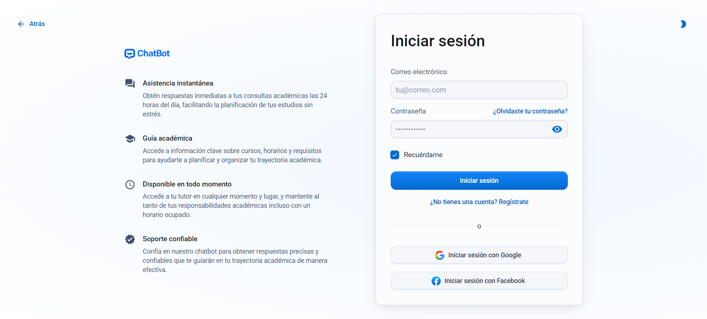

# Asistente Virtual

**Asistente Virtual** es un chatbot de inteligencia artificial diseñado para mejorar la experiencia estudiantil proporcionando información rápida y precisa sobre servicios académicos, procesos administrativos y actividades universitarias. Este proyecto está desarrollado con el stack MERN (MongoDB, Express, React, Node) para ofrecer un soporte eficiente y accesible a la comunidad universitaria.

## Funcionalidades

- **Consultas académicas:** Responde a preguntas sobre cursos, horarios, requisitos de inscripción y más.
- **Asistencia administrativa:** Ofrece ayuda con procesos administrativos, como inscripción, pagos y trámites.
- **Información en tiempo real:** Proporciona actualizaciones sobre actividades estudiantiles, eventos y fechas importantes.
- **Feedback y mejora continua:** Recoge sugerencias de los usuarios para optimizar continuamente el asistente virtual.
- **Acceso multiplataforma:** Utiliza el chatbot desde cualquier dispositivo (PC, smartphone o tablet) para obtener información al instante.
- **Disponible 24/7:** Ofrece asistencia en cualquier momento del día o de la noche, garantizando una cobertura continua.

## Características destacadas

- **Seguridad y privacidad:** La aplicación utiliza JWT (JSON Web Tokens) para la autenticación segura de usuarios y asegura que los datos personales estén protegidos.
- **Interfaz amigable:** Desarrollado con Material UI, el chatbot tiene un diseño moderno y responsivo, fácil de usar para todos los estudiantes.
- **Personalización y flexibilidad:** Aunque el chatbot responde de manera general, puede adaptarse a ciertos perfiles académicos y ofrecer respuestas más relevantes.
- **Actualización constante:** El chatbot se mejora continuamente con nuevas funciones y actualizaciones basadas en el feedback de los estudiantes.
- **Interfaz intuitiva:** Una interfaz de usuario amigable diseñada con React y Material UI V6 para una experiencia fluida y moderna.

## Tecnologías utilizadas

- **MongoDB:** Base de datos NoSQL para almacenamiento de datos.
- **Express:** Framework para la creación del servidor backend.
- **React:** Biblioteca de JavaScript para el desarrollo de la interfaz de usuario.
- **Node.js:** Entorno de ejecución de JavaScript para el backend.
- **OpenAI API:** Integra un modelo de lenguaje de IA para mejorar la interacción con los usuarios.
- **JWT:** Implementación de autenticación segura mediante JSON Web Tokens.

## Herramientas utilizadas

- [React + Vite](https://reactjs.org/)
- [Material UI V6](https://mui.com/)
- [Node.js](https://nodejs.org/)
- [Express](https://expressjs.com/)
- [MongoDB](https://www.mongodb.com/)
- [OpenAI](https://openai.com/)
- [JWT](https://jwt.io/)

## Capturas de pantalla

### Inicio

<picture>
  <source srcset="./captures/inicio-dark.png" media="(prefers-color-scheme: dark)">
  
</picture>

### Login

<picture>
  <source srcset="./frontend/public/images/captures/login-dark.png" media="(prefers-color-scheme: dark)">
  
</picture>

### Registro

<picture>
  <source srcset="./frontend/public/images/captures/registro-dark.png" media="(prefers-color-scheme: dark)">
  
</picture>

### Chat

<picture>
  <source srcset="./frontend/public/images/captures/chat-dark.png" media="(prefers-color-scheme: dark)">
  
</picture>

### Not Found

<picture>
  <source srcset="./frontend/public/images/captures/404-dark.png" media="(prefers-color-scheme: dark)">
  
</picture>

### Embeddings

<picture>
  <source srcset="./frontend/public/images/captures/process-dark.png" media="(prefers-color-scheme: dark)">
  
</picture>

## API Endpoints

### Autenticación

- **POST /api/auth/signup** – Registro de nuevos usuarios.
- **POST /api/auth/login** – Iniciar sesión.
- **GET /api/auth/logout** – Cerrar sesión.

### Chats

- **POST /api/chat/new** – Enviar un mensaje al chatbot.
- **GET /api/chat/all-chats** – Obtener el historial de chats del usuario.

## Licencia

Este proyecto está bajo la Licencia MIT. Mira el archivo [LICENSE](LICENSE) para más detalles.

## Contacto

Si tienes alguna pregunta o sugerencia, no dudes en abrir un issue o contactar al desarrollador:

- **Nombre**: Marcos Damián Pool Canul
- **Correo electrónico**: <damian.marcospool@gmail.com>
- **GitHub**: [marcosd59](https://github.com/marcosd59)
